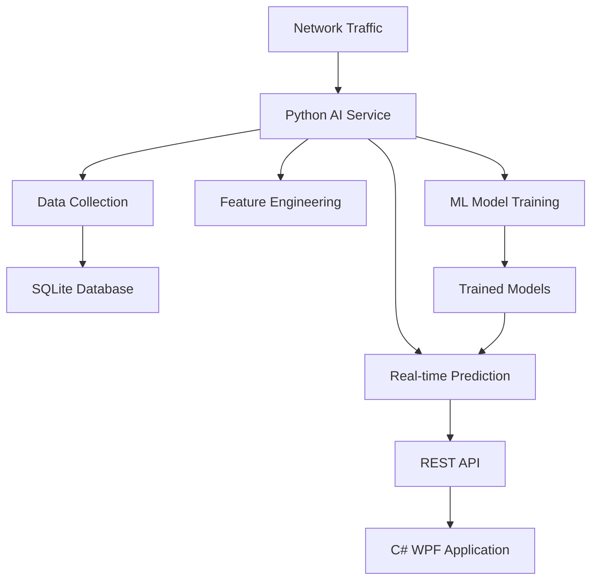

# WindowsSentinel Network AI Service

## 🎯 프로젝트 개요

WindowsSentinel의 네트워크 보안 강화를 위한 Python 기반 AI/ML 서비스입니다.
이 서비스는 네트워크 트래픽의 실시간 수집, 정상 패턴 학습, 이상 탐지 예측을 통합적으로 제공합니다.

## 🏗️ 전체 아키텍처



## 🚀 핵심 기능

### 1. 네트워크 데이터 수집

- **실시간 네트워크 연결 모니터링**
- **프로세스별 트래픽 분석**
- **패킷 레벨 분석 (선택적)**
- **시계열 데이터 저장**

### 2. 정상 패턴 학습

- **베이스라인 트래픽 패턴 학습**
- **시간대별/요일별 정상 행동 모델링**
- **프로세스별 특성 학습**
- **네트워크 사용량 패턴 분석**

### 3. 이상 탐지

- **실시간 이상 행동 탐지**
- **비정상 연결 패턴 식별**
- **의심스러운 데이터 전송 탐지**
- **신규 위협 패턴 발견**

### 4. 통합 API

- **RESTful API 제공**
- **실시간 웹소켓 지원**
- **모델 성능 모니터링**
- **자동 재학습 시스템**

## 📁 프로젝트 구조

```
network_ai_service/
├── docs/                          # 문서
│   ├── CLAUDE.md                 # 전체 가이드
│   ├── architecture.md           # 아키텍처 설계
│   ├── api-reference.md          # API 문서
│   ├── deployment.md             # 배포 가이드
│   └── development.md            # 개발 가이드
│
├── src/                          # 소스 코드
│   ├── collectors/               # 데이터 수집
│   │   ├── network_collector.py
│   │   ├── process_collector.py
│   │   └── traffic_analyzer.py
│   │
│   ├── models/                   # ML 모델
│   │   ├── baseline_learner.py
│   │   ├── anomaly_detector.py
│   │   └── threat_classifier.py
│   │
│   ├── pipeline/                 # 데이터 파이프라인
│   │   ├── data_processor.py
│   │   ├── feature_engineer.py
│   │   └── model_trainer.py
│   │
│   ├── api/                      # REST API
│   │   ├── main.py
│   │   ├── endpoints.py
│   │   └── websocket_handler.py
│   │
│   └── utils/                    # 유틸리티
│       ├── config.py
│       ├── logger.py
│       └── database.py
│
├── tests/                        # 테스트 코드
├── scripts/                      # 스크립트
├── models/                       # 저장된 모델
├── data/                         # 데이터 저장소
├── requirements.txt              # 의존성
├── docker-compose.yml            # 도커 구성
└── README.md                     # 프로젝트 설명
```

## 🔧 기술 스택

### 핵심 라이브러리

- **FastAPI**: 고성능 웹 프레임워크
- **scikit-learn**: 기본 머신러닝
- **TensorFlow/PyTorch**: 딥러닝 (선택적)
- **psutil**: 시스템 모니터링
- **scapy**: 네트워크 패킷 분석

### 데이터 처리

- **pandas**: 데이터 분석
- **numpy**: 수치 연산
- **sqlite3**: 경량 데이터베이스
- **redis**: 캐싱 (선택적)

### 모니터링 & 로깅

- **prometheus**: 메트릭 수집
- **loguru**: 로깅
- **pydantic**: 데이터 검증

## 🚦 구현 로드맵

### Phase 1: 기본 인프라 (2주)

- [ ] 프로젝트 구조 설정
- [ ] 기본 데이터 수집 모듈 구현
- [ ] SQLite 데이터베이스 설계
- [ ] 기본 REST API 구현

### Phase 2: ML 파이프라인 (3주)

- [ ] 특징 엔지니어링 파이프라인
- [ ] 베이스라인 학습 모델 구현
- [ ] 이상 탐지 모델 구현
- [ ] 모델 평가 시스템

### Phase 3: 통합 및 최적화 (2주)

- [ ] C# 애플리케이션 통합
- [ ] 실시간 예측 시스템
- [ ] 성능 최적화
- [ ] 배포 자동화

### Phase 4: 고도화 (진행중)

- [ ] 딥러닝 모델 적용
- [ ] 자동 재학습 시스템
- [ ] 분산 처리 지원
- [ ] 고급 시각화

## 📊 예상 성능 지표

### 데이터 처리 성능

- **수집 처리량**: 1,000+ 연결/초
- **예측 지연시간**: < 10ms
- **모델 정확도**: > 95%
- **False Positive**: < 2%

### 시스템 자원

- **메모리 사용량**: < 512MB
- **CPU 사용량**: < 10% (유휴 시)
- **디스크 I/O**: 최소화
- **네트워크 오버헤드**: < 1%

## 🔒 보안 고려사항

### 데이터 보안

- **개인정보 비식별화**: IP/포트 해싱
- **데이터 암호화**: 저장 데이터 AES-256
- **접근 제어**: API 키 인증
- **감사 로깅**: 모든 접근 기록

### 모델 보안

- **모델 무결성 검증**: 체크섬 검증
- **적대적 공격 방어**: 입력 검증
- **모델 버전 관리**: Git LFS 사용
- **안전한 배포**: 점진적 롤아웃

## 🤝 C# 통합 방안

### API 통신

```python
# Python API
@app.post("/api/analyze")
async def analyze_network_data(data: NetworkData):
    result = await ml_service.predict(data)
    return {"anomaly": result.is_anomaly, "confidence": result.confidence}
```

```csharp
// C# 클라이언트
public class NetworkAIClient
{
    public async Task<AnomalyResult> AnalyzeAsync(NetworkInfo info)
    {
        var response = await _httpClient.PostAsJsonAsync("/api/analyze", info);
        return await response.Content.ReadFromJsonAsync<AnomalyResult>();
    }
}
```

### 실시간 통신

- **WebSocket**: 실시간 알림
- **Server-Sent Events**: 스트리밍 업데이트
- **gRPC**: 고성능 통신 (선택적)

## 📈 모니터링 및 운영

### 핵심 메트릭

- **모델 성능**: 정확도, 재현율, F1-스코어
- **시스템 성능**: 지연시간, 처리량, 자원 사용량
- **데이터 품질**: 누락률, 이상값 비율
- **비즈니스 메트릭**: 탐지된 위협 수, 오탐률

### 알림 시스템

- **임계값 기반 알림**: 성능 저하 시 자동 알림
- **이상 탐지 알림**: 새로운 위협 발견 시 즉시 알림
- **시스템 상태**: 헬스체크 및 상태 보고

## 🎉 시작하기

### 1. 환경 설정

```bash
cd network_ai_service
python -m venv venv
source venv/bin/activate  # Windows: venv\Scripts\activate
pip install -r requirements.txt
```

### 2. 데이터베이스 초기화

```bash
python scripts/init_database.py
```

### 3. 서비스 시작

```bash
python src/api/main.py
```

### 4. 테스트 실행

```bash
pytest tests/
```

## 📚 추가 문서

- [아키텍처 설계](architecture.md) - 상세 시스템 설계
- [API 문서](api-reference.md) - REST API 명세
- [개발 가이드](development.md) - 개발 환경 설정 및 컨벤션
- [배포 가이드](deployment.md) - 프로덕션 배포 방법

---

**📞 문의사항이나 제안사항이 있으시면 언제든 연락주세요!**
