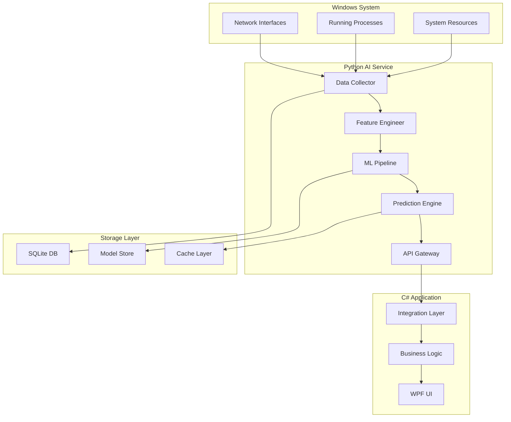
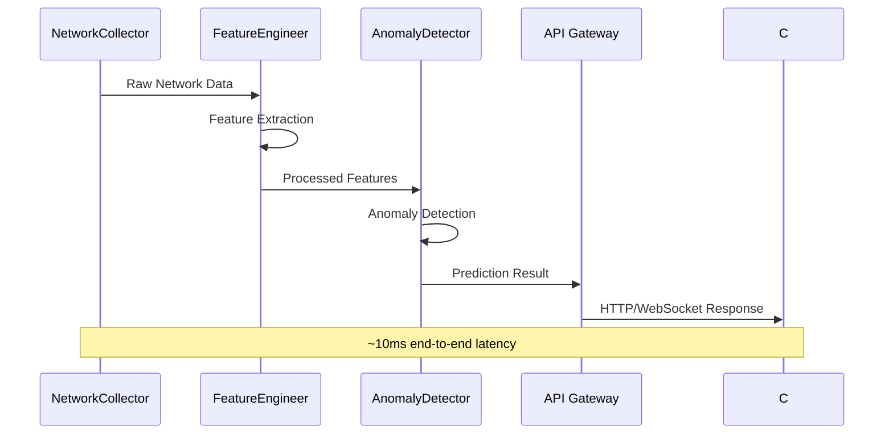
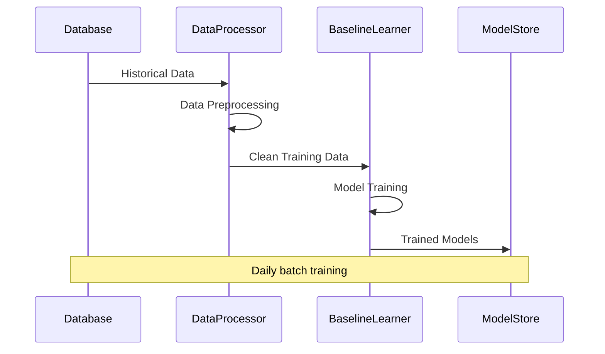

# Network AI Service - 시스템 아키텍처 설계

## 🏗️ 전체 시스템 아키텍처

### 시스템 개요

WindowsSentinel Network AI Service는 마이크로서비스 아키텍처를 기반으로 설계된 실시간 네트워크 이상 탐지 시스템입니다.



## 🔧 컴포넌트 설계

### 1. Data Collection Layer

#### NetworkCollector

```python
class NetworkCollector:
    """실시간 네트워크 연결 데이터 수집"""

    def __init__(self):
        self.collection_interval = 1.0  # 1초마다 수집
        self.buffer_size = 1000

    async def collect_connections(self) -> List[ConnectionData]:
        """활성 네트워크 연결 수집"""

    async def collect_traffic_stats(self) -> List[TrafficData]:
        """네트워크 인터페이스 통계 수집"""

    async def collect_process_network_info(self) -> List[ProcessNetworkData]:
        """프로세스별 네트워크 사용량 수집"""
```

#### ProcessCollector

```python
class ProcessCollector:
    """프로세스 정보 수집"""

    async def collect_process_info(self) -> List[ProcessInfo]:
        """실행 중인 프로세스 정보 수집"""

    async def collect_process_network_usage(self) -> Dict[int, NetworkUsage]:
        """프로세스별 네트워크 사용량 수집"""
```

### 2. Data Processing Layer

#### FeatureEngineer

```python
class FeatureEngineer:
    """특징 추출 및 전처리"""

    def extract_connection_features(self, conn_data: ConnectionData) -> ConnectionFeatures:
        """연결 기반 특징 추출"""

    def extract_temporal_features(self, time_series: List[ConnectionData]) -> TemporalFeatures:
        """시계열 특징 추출"""

    def extract_statistical_features(self, data_window: List[ConnectionData]) -> StatisticalFeatures:
        """통계적 특징 추출"""
```

#### DataProcessor

```python
class DataProcessor:
    """데이터 전처리 및 정규화"""

    def normalize_features(self, features: RawFeatures) -> NormalizedFeatures:
        """특징 정규화"""

    def handle_missing_values(self, data: DataFrame) -> DataFrame:
        """결측값 처리"""

    def create_sliding_windows(self, data: List, window_size: int) -> List[List]:
        """슬라이딩 윈도우 생성"""
```

### 3. Machine Learning Layer

#### BaselineLearner

```python
class BaselineLearner:
    """정상 네트워크 패턴 학습"""

    def __init__(self):
        self.models = {
            'isolation_forest': IsolationForest(),
            'one_class_svm': OneClassSVM(),
            'local_outlier_factor': LocalOutlierFactor()
        }

    async def train_baseline_models(self, normal_data: DataFrame) -> Dict[str, Model]:
        """베이스라인 모델 학습"""

    async def evaluate_models(self, test_data: DataFrame) -> Dict[str, Metrics]:
        """모델 평가"""
```

#### AnomalyDetector

```python
class AnomalyDetector:
    """실시간 이상 탐지"""

    def __init__(self):
        self.ensemble_models = []
        self.threshold_manager = ThresholdManager()

    async def predict_anomaly(self, features: Features) -> AnomalyResult:
        """이상 탐지 예측"""

    async def predict_batch(self, feature_batch: List[Features]) -> List[AnomalyResult]:
        """배치 예측"""
```

#### ModelEnsemble

```python
class ModelEnsemble:
    """앙상블 모델 관리"""

    def __init__(self):
        self.voting_classifier = VotingClassifier()
        self.stacking_classifier = StackingClassifier()
        self.dynamic_weights = DynamicWeights()

    def combine_predictions(self, predictions: List[Prediction]) -> FinalPrediction:
        """예측 결과 결합"""

    def update_model_weights(self, performance_metrics: Dict[str, float]):
        """모델 가중치 동적 조정"""
```

### 4. API Layer

#### FastAPI 서버 구조

```python
from fastapi import FastAPI, WebSocket
from fastapi.middleware.cors import CORSMiddleware

app = FastAPI(
    title="Network AI Service API",
    version="1.0.0",
    description="Real-time network anomaly detection service"
)

# 미들웨어 설정
app.add_middleware(CORSMiddleware, allow_origins=["*"])

# REST 엔드포인트
@app.post("/api/v1/analyze")
async def analyze_network_data(data: NetworkAnalysisRequest) -> NetworkAnalysisResponse:
    """네트워크 데이터 분석"""

@app.post("/api/v1/train")
async def train_models(config: TrainingConfig) -> TrainingResponse:
    """모델 학습 시작"""

@app.get("/api/v1/models/status")
async def get_model_status() -> ModelStatusResponse:
    """모델 상태 조회"""

# WebSocket 엔드포인트
@app.websocket("/ws/realtime")
async def websocket_endpoint(websocket: WebSocket):
    """실시간 분석 결과 스트리밍"""
```

### 5. Storage Layer

#### Database Schema

```sql
-- 네트워크 연결 데이터
CREATE TABLE network_connections (
    id INTEGER PRIMARY KEY AUTOINCREMENT,
    timestamp DATETIME NOT NULL,
    process_id INTEGER,
    process_name TEXT,
    local_ip TEXT,
    local_port INTEGER,
    remote_ip TEXT,
    remote_port INTEGER,
    protocol TEXT,
    state TEXT,
    bytes_sent INTEGER,
    bytes_received INTEGER
);

-- 특징 데이터
CREATE TABLE network_features (
    id INTEGER PRIMARY KEY AUTOINCREMENT,
    timestamp DATETIME NOT NULL,
    connection_id INTEGER,
    feature_vector TEXT,  -- JSON 형태
    label INTEGER DEFAULT 0,  -- 0: normal, 1: anomaly
    session_id TEXT,
    FOREIGN KEY (connection_id) REFERENCES network_connections(id)
);

-- 모델 성능 메트릭
CREATE TABLE model_metrics (
    id INTEGER PRIMARY KEY AUTOINCREMENT,
    model_name TEXT NOT NULL,
    timestamp DATETIME NOT NULL,
    accuracy REAL,
    precision_score REAL,
    recall REAL,
    f1_score REAL,
    auc_roc REAL,
    false_positive_rate REAL
);

-- 예측 결과
CREATE TABLE predictions (
    id INTEGER PRIMARY KEY AUTOINCREMENT,
    timestamp DATETIME NOT NULL,
    feature_id INTEGER,
    model_name TEXT,
    anomaly_score REAL,
    is_anomaly BOOLEAN,
    confidence REAL,
    explanation TEXT,
    FOREIGN KEY (feature_id) REFERENCES network_features(id)
);
```

## 📊 데이터 플로우

### 실시간 데이터 파이프라인



### 배치 학습 파이프라인



## 🔄 확장성 설계

### 수평 확장 고려사항

#### 1. 데이터 수집 스케일링

```python
class DistributedCollector:
    """분산 데이터 수집"""

    def __init__(self, node_id: str, coordinator_url: str):
        self.node_id = node_id
        self.coordinator = CoordinatorClient(coordinator_url)

    async def register_node(self):
        """노드 등록"""

    async def collect_assigned_targets(self):
        """할당된 대상만 수집"""
```

#### 2. 모델 서빙 분산화

```python
class ModelServing:
    """분산 모델 서빙"""

    def __init__(self, model_registry: ModelRegistry):
        self.registry = model_registry
        self.load_balancer = LoadBalancer()

    async def serve_prediction(self, request: PredictionRequest) -> PredictionResponse:
        """최적 모델 서버로 라우팅"""
```

### 성능 최적화

#### 1. 메모리 최적화

- **특징 벡터 압축**: 희소 행렬 사용
- **배치 처리**: 여러 요청 동시 처리
- **메모리 풀링**: 객체 재사용

#### 2. 연산 최적화

- **모델 양자화**: 16bit/8bit 정밀도 사용
- **병렬 처리**: AsyncIO 활용
- **캐싱**: 자주 사용되는 예측 결과 캐시

## 🛡️ 보안 아키텍처

### API 보안

```python
from fastapi_security import HTTPBearer, HTTPAuthorizationCredentials

security = HTTPBearer()

@app.post("/api/v1/analyze")
async def analyze_data(
    data: NetworkAnalysisRequest,
    credentials: HTTPAuthorizationCredentials = Depends(security)
):
    # JWT 토큰 검증
    user = await verify_token(credentials.credentials)
    # 권한 확인
    if not user.has_permission("analyze"):
        raise HTTPException(401, "Insufficient permissions")
```

### 데이터 보안

- **데이터 익명화**: IP 주소 해싱
- **전송 암호화**: TLS 1.3 적용
- **저장 암호화**: SQLite 데이터베이스 암호화
- **접근 로깅**: 모든 API 호출 기록

## 📈 모니터링 아키텍처

### 메트릭 수집

```python
from prometheus_client import Counter, Histogram, Gauge

# 비즈니스 메트릭
predictions_total = Counter('predictions_total', 'Total predictions made')
anomalies_detected = Counter('anomalies_detected', 'Anomalies detected')
model_accuracy = Gauge('model_accuracy', 'Current model accuracy')

# 시스템 메트릭
request_duration = Histogram('request_duration_seconds', 'Request duration')
memory_usage = Gauge('memory_usage_bytes', 'Memory usage')
```

### 알림 시스템

```python
class AlertManager:
    """알림 관리"""

    def __init__(self):
        self.thresholds = {
            'accuracy_drop': 0.05,
            'high_anomaly_rate': 0.1,
            'system_overload': 0.8
        }

    async def check_alerts(self, metrics: Dict[str, float]):
        """임계값 기반 알림 확인"""

    async def send_alert(self, alert: Alert):
        """알림 발송 (이메일, Slack, 웹훅)"""
```

이 아키텍처는 확장 가능하고 유지보수가 용이하도록 설계되었으며, WindowsSentinel 프로젝트와의 원활한 통합을 보장합니다.
